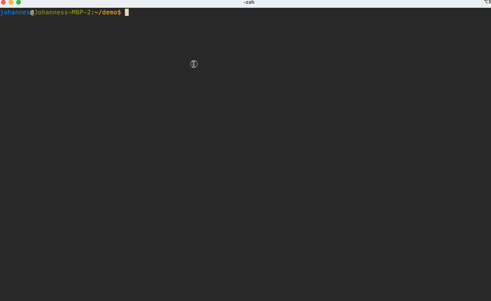

# Lambda Function AWS CDK Template

This is ready-to-use cookiecutter template to create a project that deploys a serverless AWS Lambda Function (Docker
Image) with the AWS Cloud Development Kit (CDK).

Read [lambda_stack.py](%7B%7Bcookiecutter.REPO_NAME%7D%7D%2Flambda_stack.py) for a detailed description.

## Requirements

- [Python 3.10](https://www.python.org/downloads/)
- [Cookiecutter](https://github.com/cookiecutter/cookiecutter)
- [Configs](#configs)

## Configs

You must provide a config path that contains these files in this directory structure
OR create an empty configs directory:

```text
.
├── schemas
│       ├── schema-v1.json
│       ├── schema-v1.json
│       ├── ...
├── input.json
├── output.json
├── transform.json
└── secrets.json
```

If you do not want to provide secrets or transform instructions, create an empty JSON file for each:

```json
{}
```

### input.json (required)

The `input.json` must contain the keys: `type` and `arn`.
All other fields are **type-specific**.

```json
{
  "type": "OutputType",
  "arn": "arn"
}
```

Available types:

- `kinesis`

### output.json (required)

The `output.json` must contain the keys: `type` and `arn`.
All other fields are **type-specific**.

```json
{
  "type": "OutputType",
  "arn": "arn"
}
```

Available types:

- `kinesis` - [/configs-kinesis/output.json](%7B%7Bcookiecutter.REPO_NAME%7D%7D%2Fconfigs-kinesis%2Foutput.json)
- `postgresql` - [/configs-postgresql/output.json](%7B%7Bcookiecutter.REPO_NAME%7D%7D%2Fconfigs-postgresql%2Fconfigs-kinesis%2Foutput.json)

### schemas(required)

The schema configuration files must in JSON schema format.

Example:

```json
{
  "$schema": "http://json-schema.org/draft-07/schema#",
  "version": "v1",
  "type": "object",
  "properties": {
    "version": {
      "type": "string"
    },
    "id": {
      "type": "integer"
    },
    "name": {
      "type": "string"
    },
    "age": {
      "type": "integer"
    },
    "email": {
      "type": "string",
      "format": "email"
    }
  },
  "required": [
    "version",
    "id",
    "name"
  ]
}
```

### secrets.json (optional)

Every `key` must match with a name in AWS Secrets Manager.
The value is the `arn` of the secret.

```json
{
  "key": "arn"
}
```

### transform.json (optional)

Every `key` must match with a name (stem) in the `configs/schemas` directory.
The value must be a JSON string (JMESPath payload).

```json
{
  "schema-v1": [
    "{'id': 'id', 'fullname': 'name'}"
  ]
}
```

## How to use

Clone and change to this repository. Execute cookiecutter and follow the input directions.

```shell
git clone git@github.com:dmesh-io/lambda-cdk-template.git
cd cdk-lambda
cookiecutter .
```

OR do this in one step:

```shell
cookiecutter git@github.com:dmesh-io/lambda-cdk-template.git
```



## TODO:

- [ ] Improve validations in [hooks](hooks)
